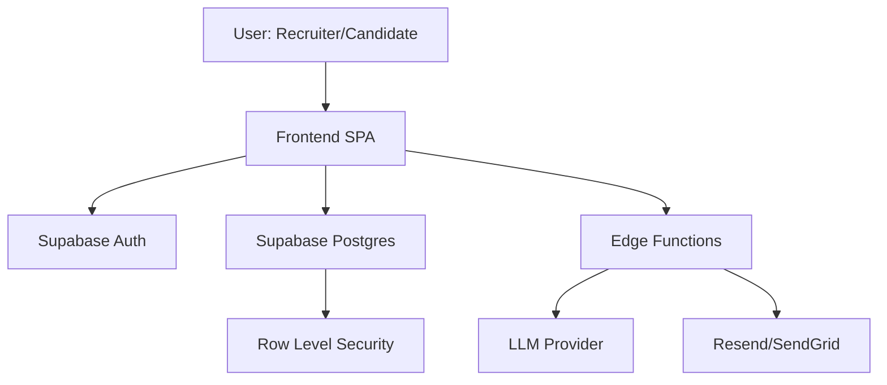

# InterQ Platform - System Architecture & Implementation Roadmap

## 1. System Architecture

### High-Level Tech Stack
*   **Frontend:** React (Vite), TypeScript, Tailwind CSS, Shadcn/UI (Accessibility-first).
*   **Backend / Database:** Supabase (PostgreSQL, Auth, Realtime, Edge Functions).
*   **AI Engine:** OpenAI GPT-4o / Anthropic Claude 3.5 (via Edge Functions) for text-based scoring.
*   **Storage:** Supabase Storage (Video recordings, candidate resumes).

### Information Architecture

## 2. Core Feature Breakdown & Scoring Logic

### A. AI Skills Assessment & Scoring Logic
**Philosophy:** Evaluation is performed *only* on the content of the response (transcript/code), **never** on facial features or voice patterns to eliminate bias.
*   **Input:** Audio moves to -> Speech-to-Text (Whisper) -> Text Transcript.
*   **Process:** 
    1.  Transcript is anonymized (PII removal).
    2.  LLM compares Anonymized Transcript vs. Structured Rubric.
    3.  Scores assigned (1-10) for specific criteria (e.g., "Clarity", "Technical Accuracy").
*   **Output:** JSON Scorecard + Summary Feedback.

### B. Bias Reduction Strategy
*   **Anonymization Layer:** DB Views for "Blind Review" hide `name`, `email`, `avatar` from the Evaluation UI.
*   **Standardized Scoring:** All candidates for Job X answer the same Question Set Y and are graded against Rubric Z.

## 3. Database Schema (Planned)

| Table | Purpose |
| :--- | :--- |
| `jobs` | Stores job titles, descriptions, and active status. |
| `assessments` | Templates for interviews (e.g., "Senior React Dev Screen"). |
| `job_assessments` | Link table aiming specific assessments to jobs. |
| `questions` | The actual challenges (Text, Video, Code). |
| `applications` | Links Candidate -> Job. |
| `submissions` | The raw video/text response from a candidate. |
| `evaluations` | AI-generated scores and human overrides. |

## 4. MVP vs. Phase-2 Roadmap

### Phase 1: MVP (Foundation)
*   **Recruiter:** Create Job, Create Simple Assessment (3 questions), View Candidate List.
*   **Candidate:** Landing Page -> Login -> Take Video Interview -> Submit.
*   **AI:** Basic Transcription + Keyword Match Scoring.
*   **Admin:** Invite Users.

### Phase 2: Enhanced Intelligence (Differentiation)
*   **AI:** Full Rubric Grading, Behavioral Analysis (Text-based).
*   **Recruiter:** Heatmaps, Comparative Analytics.
*   **Integrations:** ATS Connectors, Live Video Interview tools.
*   **Security:** Audit Logs, DEI Reporting.

## 5. API & Integration Strategy
*   **Webhooks:** Outbound webhooks on `assessment.completed` events to notify external ATS.
*   **REST API:** `/api/v1/candidates` for bulk import/export.
*   **OAuth:** For Calendar (Google/Outlook) and Zoom integrations.
