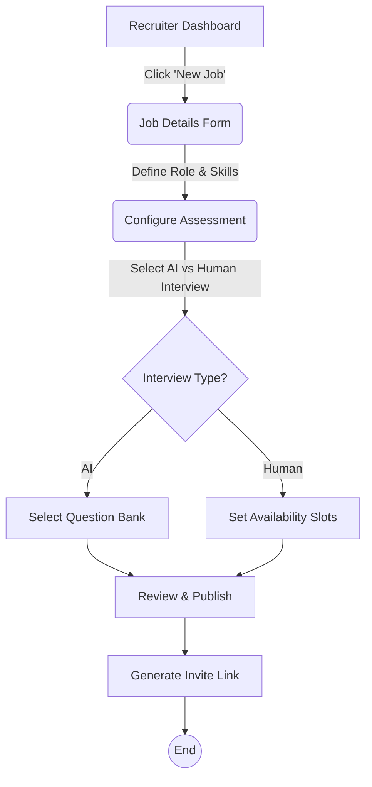
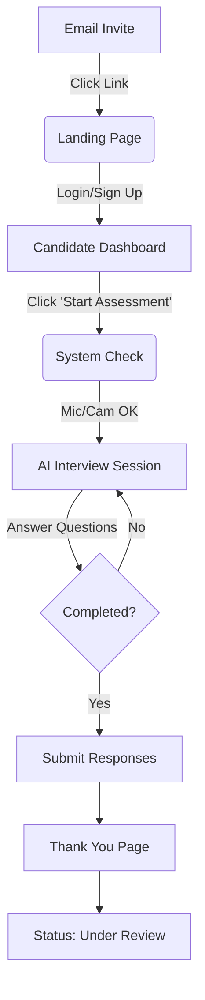
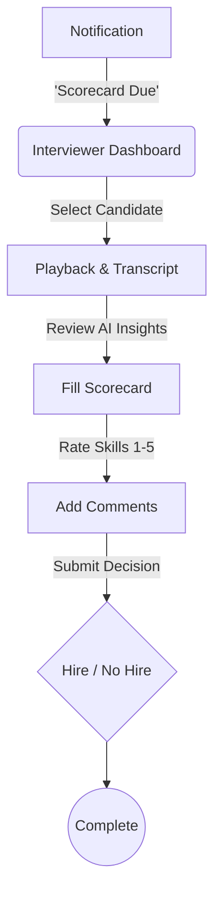

# InterQ Platform - User Flows & Wireframe Specifications

This document outlines the core user journeys, information architecture, and screen layouts for the InterQ platform.

## 1. User Roles & Core Responsibilities

| Role | Key Goal | Primary Dashboard View |
| :--- | :--- | :--- |
| **Recruiter** | Manage pipeline & hiring speed | **Overview Dashboard:** Active jobs, candidate status, upcoming interviews. |
| **Interviewer** | Conduct fair, efficient interviews | **Task List:** Assigned interviews, scorecard inputs, past feedback. |
| **Candidate** | Complete assessments & track status | **Application Hub:** Active applications, "Star Interview" button, status tracker. |

---

## 2. Navigation Structure

### Recruiter (Admin) Map
*   **Dashboard** (KPIs: Time to Hire, Pipeline Health)
*   **Jobs**
    *   Create Job
    *   Job Detail -> Candidates List
*   **Candidates**
    *   Candidate Profile -> Results & Recordings
*   **Scheduling** (Calendar View)
*   **Settings** (Integrations, Team, Billing)

### Interviewer Map
*   **My Interviews** (Today/Upcoming)
*   **Evaluation Queue** (Pending Scorecards)
*   **Candidate Library** (Read-only view of past candidates)

### Candidate Map
*   **Home** (Current Application Status)
*   **Assessments** (Active tasks)
*   **Profile** (Resume & Preferences)

---

## 3. User Flow Diagrams

### Flow A: Recruiter - Job Creation & Invite

### Flow B: Candidate - Application & Interview

### Flow C: Interviewer - Evaluation (Human Loop)

---

## 4. Wireframe Specifications (Mid-Fidelity)

### Screen 1: Recruiter Dashboard
**Layout:** 3-Column Grid
*   **Header:** Welcome [Name], Quick Actions (New Job, Invite Candidate).
*   **Left sidebar:** Navigation (Icons + Labels).
*   **Main Content:**
    *   *Top Row:* 3 Key Metric Cards (Active Jobs, Pending Reviews, Offer Acceptance Rate).
    *   *Middle Row:* "Recent Activity" feed (Candidate X completed test) vs "Upcoming Interviews".
    *   *Bottom Row:* Pipeline Chart (Visual funnel).

### Screen 2: Candidate Interview Portal
**Layout:** Focused / Immersive (No sidebar)
*   **Header:** Progress Bar (Question 3 of 10), Time Remaining.
*   **Center:**
    *   *Video Feed:* Large self-view (or avatar interviewer).
    *   *Question:* Clear text overlay 'Tell me about a time you failed.'
    *   *Controls:* Record, Stop, Settings.
*   **Footer:** "Next Question" (Disabled until answer recorded).

### Screen 3: Evaluation Screen (Interviewer)
**Layout:** Split Screen
*   **Left Panel (Source):**
    *   Video Player with timestamps.
    *   Scrollable Transcript with AI-highlighted keywords.
*   **Right Panel (Evaluation):**
    *   Scorecard form (Scrollable).
    *   Rubric tooltips on hover.
    *   Floating "Submit" footer.
